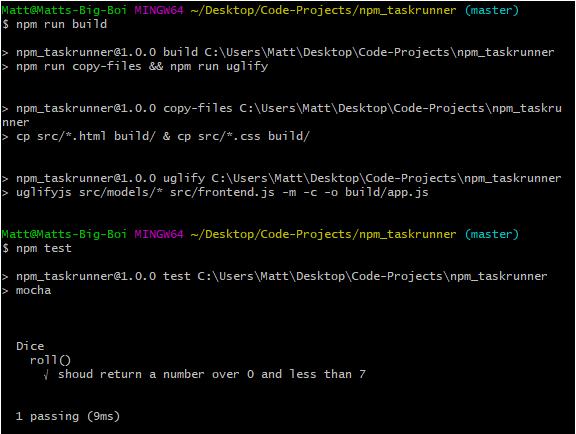

# Dice Simulator 9000

## Description:
 Here we are using npm and uglify-js to create task runners to take our code and consolidate it into the build folder. 

#### Requirements:
 Uglify-js & Mocha are required dependencies. Use <$npm install> to add them to your local machine once you have downloaded this project. 

 Use the index.html located in the build/ folder (not the one in the src/ folder) to view the actual dice simulator. 